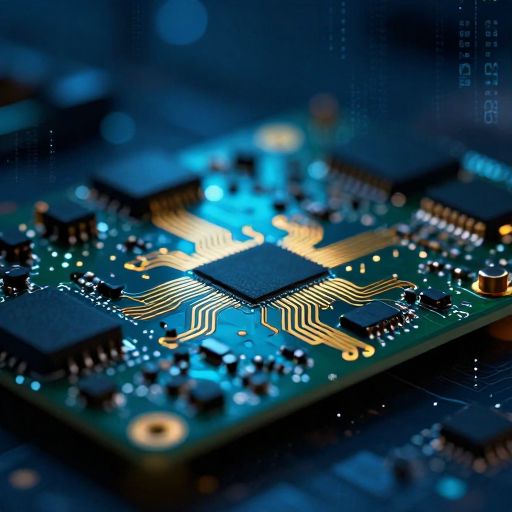

# 👋 Hi there! I'm [iliyalojati]

  

## 🔭 About Me
I am a developer and engineer with a deep passion for **embedded systems** and low-level programming. I thrive on turning complex hardware challenges into elegant, efficient software solutions. My journey is defined by a curiosity to understand how things work at the hardware level and the drive to build robust, scalable code.

## 🛠 Technical Stack
| Category | Technologies |
| :--- | :--- |
| **Embedded Systems** | AVR, ESP8266 (ESP-01), STM32, Arduino |
| **Languages** | C, C++, Assembly |
| **Software & Tools** | CodeVisionAVR, Git, VS Code, Altium Designer |
| **Interests** | Geometric Modeling, Wave Functions, Automation |

## 🚀 Current Focus
- **Library Development:** Currently building a comprehensive CodeVisionAVR library for WS2812 addressable LEDs, including reusable effects like rainbows.
- **Project Work:** Actively maintaining the **ESP01-Relay-Control** project to simplify IoT-based relay management.
- **Learning:** Exploring advanced mathematical concepts for real-world geometric tiling and visualization.

## 📬 Let's Connect
I'm always open to discussing new ideas, collaborating on embedded projects, or just geeking out about hardware.
- Feel free to check my repositories or [add your contact/social link here].

---
*Always learning, always building.*
